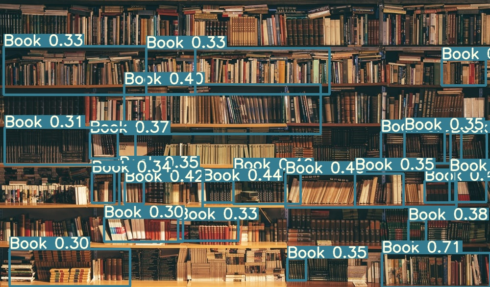
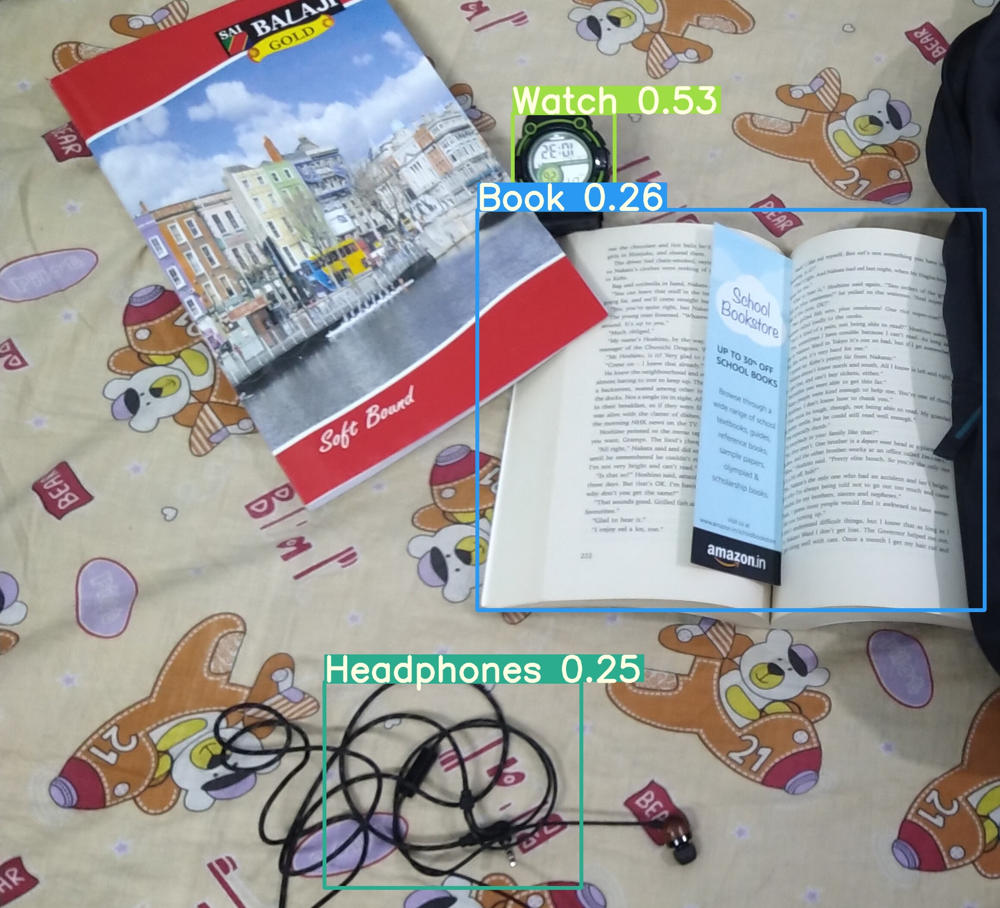

# Custom Object Detection With YoloV3

This repository contains to code train your own custom object detector using YOLOv3 

I have posted a tutorial guide on my blog and in medium platform also to train your own model. Here's the link:

- [Medium](https://medium.com/analytics-vidhya/custom-object-detection-with-yolov3-8f72fe8ced79) 
- [Personal Blog](https://thecodemonk.in/software/object-detection-yolov3) 

Below are some image inference results you can see :

If you have any questions, recommendations or critiques, I can be reached via [Twitter](https://twitter.com/thecaffeinedev) or via my [mail](mailto:prabhat1015@gmail.com). Feel free to reach out to me.

### References and Credit

1. https://medium.com/syncedreview/google-releases-open-image-v5-launches-open-image-challenge-91fa802f0edf
2. https://github.com/ultralytics/yolov3
3. https://pylessons.com/